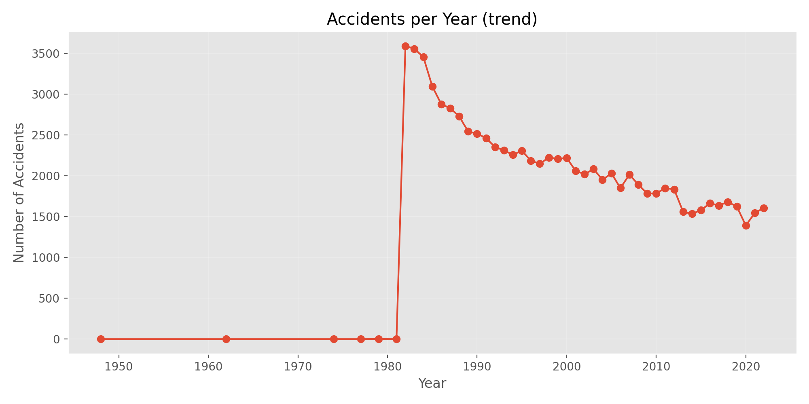
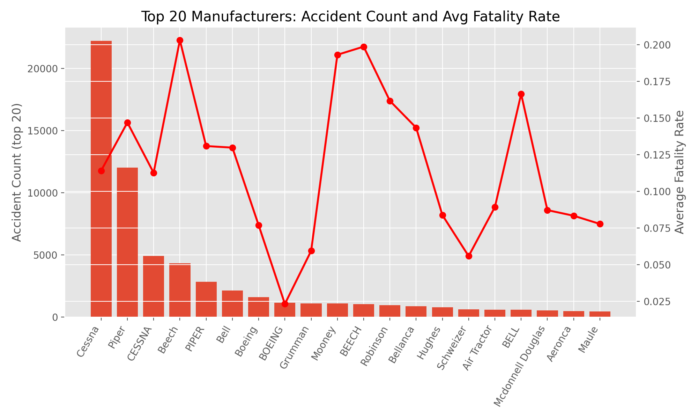
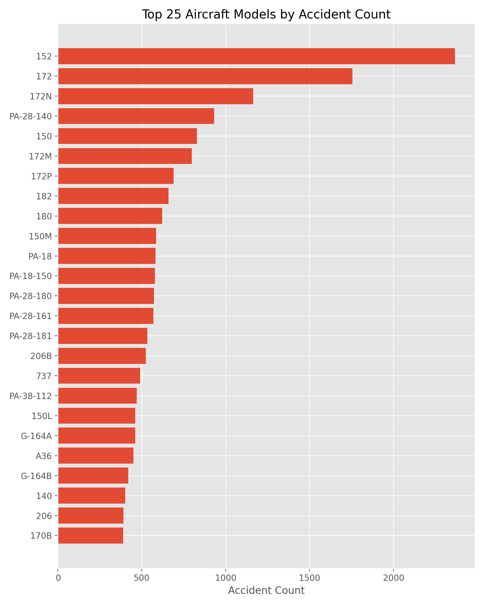
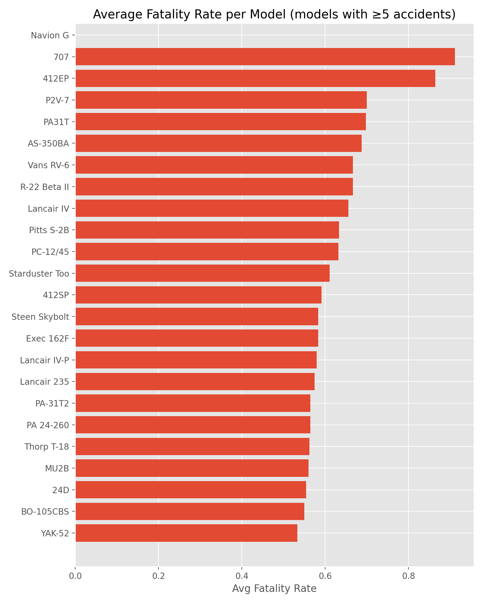
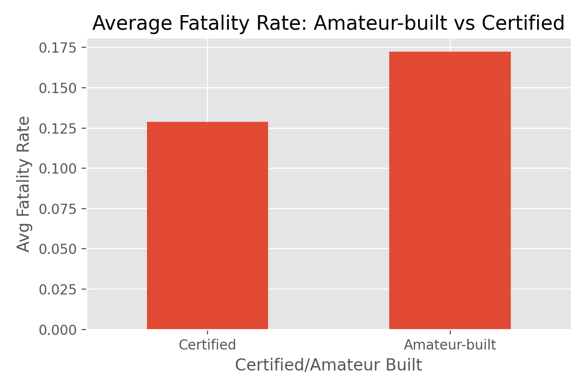
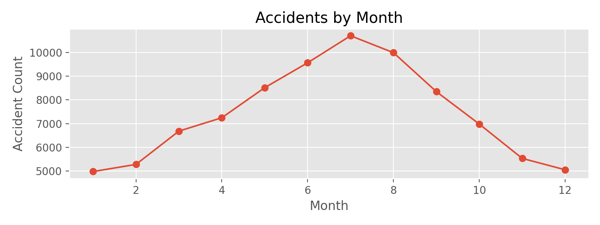

# New Aviation Low-Risk Aircraft Purchase Project

## Introduction
This project analyzes aviation accidents a data collected from **1962–2023**, covering civil aviation accidents in the USA and selected international waters.
The goal is to provide actionable insights to the head of New Aviation Division to support **informed investment decisions** when purchasing and operating low-risk aircraft for  commercial and private enterprises.  

By analysing historical accident trends, aircraft models, and accident patterns, this analysis will help identify **aircraft with lower operational risk**, ensuring safer investments for the New Aviation division.  

## Key Analysis Questions
To guide the analysis and provide insights relevant to decision-making, I will explore the following questions:

1. **Aircraft Risk Assessment**
   - Which aircraft models have the lowest accident and incident rates historically?
   - Are there trends in accident frequency based on aircraft age or manufacturer?
   
2. **Geographical Patterns**
   - Are certain regions or airspaces associated with higher incident rates?
   - Do accidents in international waters differ significantly from those in the USA?

3. **Operational and Safety Insights**
   - What factors (pilot experience, aircraft type, weather conditions) correlate with higher accident risk?
   - Are there particular operational conditions that consistently show low-risk performance?

## Stakeholder Questions
From a business and investment perspective, stakeholders would want to know:

- Which aircraft models are **safe and reliable for commercial or private operations**?  
- Are there aircraft types that offer **lower insurance costs or regulatory risk**?  
- How does historical safety performance inform **fleet diversification and procurement strategy**?  
- What operational precautions can be implemented to **minimize accident risk** for purchased aircraft?

---

## Project Structure

New-Aviation-LowRisk-AircraftPurchase-Project/
├── .ipynb_checkpoints/   # Auto-saved notebook files (ignored by .gitignore)
├── Data/                 # Dataset folder (tracked)
├── Presentation/         # Powerpoint Slides file(tracked)       
├── .gitignore            # Git ignore rules (tracked)
├── Brian.ipynb           # Main Jupyter notebook (tracked)
└── README.md             # Project overview and instructions (tracked)

## Dataset loading & initial Exploration
The analysis begins by loading the AviationData.csv, which entails approx. 88,000 aviation accidents and incident records from 1962-2023.
This step shows the dataset's structure:
- The number or row and columns
- Features available for analysis
- The initial distribution of the key attributes
- Red flags: missing values, inconsistent formatting or duplicated columns

**N/B This stage informs as on the strategy of cleaning and also ensures that each approach is based on accurate and well understood data.**

### ** Standardizing Column Names**

The original dataset included column names with spaces, punctuation marks, and inconsistent formatting.  
To ensure correct analysis and avoid errors when referencing columns in Python, all column names were standardized by:

- Converting to lowercase  
- Replacing spaces and punctuation with underscores  
- Removing inconsistent characters  

This normalization step ensures that all variables can be accessed easily and consistently throughout the project.

### ** Parsing Date Columns & Missing Values Assessment**

A key part of preparing the dataset involved identifying and converting date fields into proper datetime format. Since aviation accidents are recorded chronologically, parsing these columns correctly allows for trend analysis and time-based insights.

Additionally, a missing values assessment was performed to quantify the completeness of each column.  
Understanding missingness early helps guide decisions on whether to drop, impute, or engineer features during the cleaning and modeling stages.

A working cleaned dataset (`AviationData_working.csv`) was saved after this transformation.

### Missing Value Assessment & Cleaning Decisions

To understand the overall quality of the dataset and guide effective preprocessing, a missing-value analysis was performed. This allowed us to identify columns that contain too many missing values to be analytically useful, as well as columns that are important for safety-risk assessment and must be retained.

##  Key Findings
Several columns show extremely high missing percentages (60–85%). These include:
- `schedule`
- `aircarrier`
- `fardescription`
- `longitude`
- `latitude`

Columns with such high missingness provide limited value for risk evaluation and will be removed from the dataset.

Other columns show moderate missingness but are important for aircraft safety profiling. These will be retained and cleaned through imputation:
- `aircraftcategory`
- `purposeofflight`
- `weathercondition`
- `broadphaseofflight`

Columns related to injuries, aircraft specifications, and event characteristics show low missingness and will be kept for further analysis.

##  Cleaning Decisions
1. **Drop columns with extremely high missingness (>60%)**  
   These fields do not contribute meaningfully to risk analysis and will be removed.

2. **Impute key categorical fields with `'Unknown'`**  
   For important analytical columns that contain some missing values, imputation will ensure consistency without losing valuable records.

3. **Retain all operational, aircraft-specific, injury-related, and event-detail columns**  
   These form the foundation for the aircraft risk evaluation models and dashboards that will be built later in the project.

This step ensures the dataset is clean, consistent, and aligned with the project’s goal of identifying low-risk aircraft for stakeholder procurement.

##  Handling Missing Data

After identifying the missing value percentages, we applied a targeted cleaning strategy to preserve data quality while removing unusable columns.

**Columns Removed (Too Much Missing Data)**  
The following columns had more than 50% missing values and were removed from the dataset because they were unreliable for analysis and not essential to the stakeholder’s risk evaluation:

- `schedule` (85.85% missing)  
- `aircarrier` (81.27% missing)  
- `fardescription` (63.97% missing)  
- `aircraftcategory` (63.68% missing)  
- `longitude` (61.33% missing)  
- `latitude` (61.32% missing)

**Columns Kept and Cleaned Where Necessary**  
Columns below 50% missing were kept because they contain useful safety or aircraft information relevant to assessing accident risks. These will be cleaned further using imputation or domain-based corrections in later steps.

This step prepares the dataset for deeper analysis by removing noise and preserving high-value fields that support the stakeholder’s decision-making.

## Outlier Inspection

We inspected outliers in key injury/fatality counts using an IQR method. Outliers were flagged but not removed. Each flagged case will be reviewed manually if needed during deeper investigation.

## Outlier Check – What I Found

When I checked the data for unusually high or low numbers in the injury columns, I discovered that many rows were marked as “outliers.” Specifically:

- 17,813 cases for total fatal injuries

- 15,502 cases for total minor injuries

- 13,090 cases for total serious injuries

What this really means

These numbers may look surprising, but they don’t mean the data is wrong. Aviation accident data naturally has:

Many incidents with no injuries at all, and

A smaller number of incidents with very high injury counts

Because of this, the computer labels a lot of these high-injury cases as “unusual,” even though they are real and important events.

Why this matters

For stakeholders who want to understand accident severity or make decisions about aircraft operations, these high-injury events are crucial. Removing them would hide the most serious accidents.

What I decided

I will keep all these values in the dataset.
They represent real incidents, and they help us understand true accident patterns rather than just the averages.

####  Feature Engineering

Created risk-focused features:
- `accident_year`, `accident_month`
- `total_injuries` (normalized)
- `fatal` (normalized)
- `fatality_rate` = fatal / (total_injuries + 1)
- `is_amateur_built` boolean, this helps compare risk of amateur vs certified planes

These features are used to compute per-model and per-manufacturer risk indicators.

##  Features Analysis

---

## 1. Accidents per Year — Trend Analysis

### Plot

The chart shows the number of aviation accidents recorded each year from 1948 to 2021. Several key patterns emerge:

---

###  Sudden Spike Around 1982–1983

A sharp increase appears, jumping from almost zero recorded accidents to more than 3,500 in a single year.

**Why this happened:**  
This does *not* reflect a real-world surge in accidents. It is due to:

- Changes in reporting standards  
- Integration of historical databases  
- More complete NTSB digitization starting in the early 1980s  

Many incidents before this period were simply not recorded.

**What this means:**  
- The dataset becomes **reliable starting from the early 1980s**.

---

###  Long-Term Decline in Accidents (1983 → 2021)

After reporting improved, accident counts steadily decrease.

**This reflects:**

- Advances in aircraft engineering  
- Stronger aviation regulations  
- Better pilot training  
- Improved maintenance standards  
- Modern navigation and safety tech (GPS, TCAS, avionics)

**Stakeholder insight:**  
- Modern aircraft are statistically much safer than older generations.

---

###  Stabilization Since the Early 2000s

From around 2000 onward, accident numbers flatten at a stable, lower level.

**Interpretation:**

- The industry reached a mature safety phase  
- Improvements are now incremental  
- Shows consistent safety performance

- This supports confidence in purchasing modern aircraft.

---

###  Why This Matters for Selecting Low-Risk Aircraft

This trend analysis offers important guidance:

1. **Risk assessment should focus on recent decades**, not the full historical dataset.  
2. **Aircraft models introduced after 1990–2000 carry significantly lower operational risk.**  
3. The long-term decline confirms improving aviation safety over time.  
4. Accident-per-year data can help weight risk scores by aircraft age or decade.

---
##  Manufacturer Analysis — Accident Count vs. Average Fatality Rate

###  Overview
The chart below compares the **top 20 aircraft manufacturers** based on accident count. It also overlays the **average fatality rate** for each manufacturer.

This combined view helps identify manufacturers with both:
- High accident involvement, and  
- High or low severity outcomes.

---

###  1. Cessna Dominates Accident Counts
Cessna shows the **highest number of recorded accidents**, far more than any other manufacturer.

**Why this doesn’t necessarily mean Cessna is unsafe:**
- Cessna has produced **hundreds of thousands of small general aviation aircraft**.
- These aircraft are widely used for training, rentals, and private flying.
- More aircraft in operation → more exposure → more reported accidents.

 **High exposure, not necessarily high risk per aircraft.**

---

###  2. Piper and Beechcraft Also Show High Accident Totals
Piper and Beechcraft also appear near the top of the list.

**Reason:**  
They manufacture popular general aviation aircraft used by private pilots and flight schools.

- These brands account for a large share of the U.S. general aviation fleet.

---

###  3. Fatality Rate Varies Significantly Across Manufacturers
The red line shows that **fatality rates do not always match accident counts**.

Key notes:
- Some manufacturers with *moderate* accident counts have **higher fatality rates**.
- Some with *high* accident counts (e.g., Cessna) actually show **lower average fatality severity**.

This means:
- Accident **frequency** and **accident severity** must be evaluated separately.

---

###  4. Smaller and Specialized Manufacturers Show Higher Variability
Brands with fewer total aircraft (e.g., Mooney, Bellanca, Schweizer) show **more variability** in fatality rates.

This is expected because:
- A few severe accidents can raise the average sharply.
- Their fleet sizes are smaller, so each event has a larger impact.

---

###  What This Means for Selecting Lower-Risk Aircraft

**1. High accident counts correlate with high usage, not necessarily unsafe design.**  
Cessna, Piper, Beechcraft appear frequently because they dominate general aviation.

**2. Fatality rate is a better indicator of severity.**  
Manufacturers with consistently low fatality rates may indicate safer system design, better stability, or aircraft purpose (trainer vs. high-performance aircraft).

**3. Fleet size must be considered.**  
Some smaller brands appear riskier because their samples are small.

**4. For buyers and operators:**  
- Recent-generation Cessna, Piper, Beechcraft, and Cirrus models are widely used and have strong safety performance.  
- Consider both accident and severity metrics when evaluating models for purchase.

---
##  Aircraft Model Analysis — Top 25 Models by Accident Count

###  Overview
The chart below highlights the **25 aircraft models with the highest number of recorded accidents**. This gives a clearer view of which aircraft types appear most frequently in accident reports.

---

###  1. Cessna Trainer Models Dominate the List
The **Cessna 152, 172, and 172N** appear at the very top with the highest accident counts.

**Why these models lead the list:**

- They are the **most common training aircraft** worldwide.  
- Used heavily in flight schools for student pilots.  
- High daily usage and repeated takeoffs/landings increase exposure.  
- Large global fleet size.

 **More aircraft + more training flights = more recorded accidents**, not necessarily unsafe design.

---

###  2. Piper PA-28 Series Appears Repeatedly
Several Piper models (PA-28-140, PA-28-150, PA-28-161, etc.) also show high accident presence.

**Reason:**  
Like Cessna, the PA-28 family is widely used for:
- Flight training  
- Private flying  
- Small commercial operations  

Their popularity naturally increases their representation in accident data.

---

###  3. Most Models in the Top 25 Are General Aviation (GA)
The list is dominated by small single-engine piston aircraft — not commercial jets.

This is because:
- GA aircraft fly **many more individual flights**.  
- Pilots range from students to hobbyists with varying experience.  
- GA flights operate in uncontrolled environments (rural airstrips, grass fields, etc.).  
- Reporting is consistent and centralized in the U.S.

- Accident count is more about **usage patterns and pilot experience** than model failure.

---

###  4. Only a Few Larger / Commercial Models Appear
Examples include:
- **Boeing 737**
- **Cessna 206 series**

These appear far lower on the list.

**Reason:**  
Commercial aircraft have:
- Highly trained crews  
- Strict regulation and maintenance  
- Far fewer operators  
- Far fewer total aircraft compared to GA fleets

 The low counts reinforce that commercial aircraft have **much lower accident rates**.

---

###  What This Means for Aircraft Selection

1. **High accident counts usually reflect high fleet size, not poor safety.**  
   Cessna and Piper dominate because they are used everywhere, especially for training.

2. **GA aircraft have more accidents but serve different uses**  
   — their risk profile is not comparable to commercial jets.

3. **Accident counts alone do not indicate risk.**  
   They must be paired with:
   - Fatality rate  
   - Fleet size  
   - Typical mission (training vs transport)  
   - Model age and generation  

4. **For buyers and operators:**  
   Modern variants of the Cessna 172, Piper PA-28, and similar models remain widely trusted and commonly used for training and private operations due to reliable safety records over decades.

##  Aircraft Models with the Highest Fatality Rates (Models with ≥5 Accidents)

###  Overview
The chart below shows aircraft models with the **highest average fatality rates**, but only for models that have had **at least 5 recorded accidents**.  
This helps avoid misleading results from very rare, one-off events.

---

###  1. High Fatality Rate Does Not Mean the Model Is Unsafe by Design
Several aircraft models show fatality rates between **0.6 and 0.9**, meaning that **60–90% of accidents involving these models resulted in fatalities**.

However, this does *not* necessarily indicate poor engineering.  
Instead, many of the models at the top of the list share common characteristics:

- **High-performance experimental aircraft**
- **Older legacy aircraft no longer widely produced**
- **Special-purpose aircraft (aerobatic, homebuilt, experimental class)**
- **Rotorcraft with unique operational environments**

- Many of these aircraft are flown by pilots in **high-risk missions**, not routine transportation.

---

### - 2. Aerobatic, Homebuilt, and Experimental Aircraft Are Over-represented
Models such as:

- **Pitts S-2B**  
- **Starduster Too**  
- **Steen Skybolt**  
- **Lancair models (IV, IV-P, 235)**  
- **Thorp T-18**

are designed for:

- Aerobatic flying  
- High-speed performance  
- Homebuilt/kit construction  

These aircraft tend to have:
- Higher stall speeds  
- Less forgiving handling  
- Pilots with specialized training requirements  
- More risk-prone flight profiles  

- Their higher fatality rates reflect *usage patterns*, not necessarily construction issues.

---

###  3. Helicopters and Unique-Mission Aircraft Also Feature
Examples like:

- **R-22 Beta II**
- **BO-105CBS**

operate in demanding roles (training, utility, law enforcement), often at low altitude.

Low-altitude operations → less time for recovery → higher severity.

---

###  4. Commercial and Modern GA Aircraft Are Largely Absent
Notably, the following are **not** present among high-fatality-rate models:

- Modern Cessna 172/182  
- Piper PA-28 families  
- Cirrus SR-series  
- Mainstream commercial jets  

- These categories show significantly lower fatality rates in general aviation and commercial operations.

---

###  What This Means for Aircraft Selection

1. **High fatality rate often reflects mission type, not poor design.**
   Aerobatic and experimental models show higher risk because of how and where they are flown.

2. **Mainstream general aviation aircraft (Cessna, Piper, Cirrus) maintain far lower fatality rates.**

3. **Stakeholders evaluating safety should focus on:**
   - Modern, certified production aircraft  
   - Proven safety records in training and transport roles  

4. **High-fatality-rate models are typically unsuitable for commercial or low-risk private operations.**

---

##  Fatality Rate by Purpose of Flight (Top 15 Categories)

###  Overview  
This chart summarizes the **average fatality rate by purpose of flight**, focusing on the 15 categories with the highest number of recorded accidents.  
Different types of flight operations carry different inherent risk levels based on mission profile, altitude, pilot workload, and environmental conditions.

---

###  1. Specialized & High-Risk Missions Have the Highest Fatality Rates  
The categories with the highest fatality ratios include:

- **Skydiving operations**  
- **Air race/show**  
- **External load operations**  
- **Flight test**

These operations typically involve:

- Low-altitude maneuvering  
- High performance envelopes  
- Aerobatics or aggressive flight profiles  
- Limited recovery margins  

 These elevated fatality rates reflect the **mission type**, not necessarily unsafe aircraft.

---

###  2. Public, Corporate, and Observational Operations Are Moderate  
Categories like:

- **Aerial observation**  
- **Executive/corporate**  
- **Public aircraft**  

show fatality rates around *15–18%*.  
These operations often involve specialized missions, unique airspace constraints, or longer-duration flights.

---

###  3. Personal, Instructional, and Business Flights Show Lower to Mid-Level Rates  
- **Personal** and **business** flights have moderate fatality rates (13–17%).  
- **Instructional flights** have one of the **lowest fatality rates (~7%)**, driven by:
  - Dual controls  
  - Instructor supervision  
  - Low flight altitudes  
  - Training-focused safety culture  

- This aligns with expectations—training flights often involve risk management frameworks and structured procedures.

---

###  4. Ferry, Positioning, and Utility Work Present Mid-High Risk  
These missions sometimes involve:

- Long-distance relocations  
- Single-pilot operations  
- Fatigue or unfamiliar routings  
- Minimal payload and specific operating requirements  

Which contributes to fatality rates in the **12–17%** range.

---

###  Key Takeaways for Stakeholders

1. **Mission type strongly predicts fatality severity**—far more than aircraft manufacturer or model.
2. **High-risk categories (Air Race, Skydiving, Flight Test)** are niche operations and not relevant to traditional commercial or private transport.
3. **Instructional, business, and personal flights remain the safest mainstream categories.**
4. For most procurement decisions, prioritize:
   - Certified aircraft  
   - Standard mission profiles  
   - Well-established operational procedures  

This ensures alignment with low-risk flight categories.

---

##  Average Fatality Rate: Amateur-Built vs Certified Aircraft

This chart compares the average fatality rate between **FAA-certified aircraft** and **amateur-built (experimental/homebuilt)** aircraft.

### Key Insights

#### 1. Amateur-built aircraft show a significantly higher fatality rate  
The average fatality rate for amateur-built aircraft is **notably higher** than that of certified aircraft.  
This aligns with long-established findings in aviation safety:

- Amateur-built aircraft often vary in construction quality, depending on builder skill level.
- They may use non-standardized components or custom modifications.
- Flight testing phases typically involve higher risk.
- Pilots operating amateur-built aircraft may have varying levels of experience.

#### 2. Certified aircraft demonstrate more predictable safety outcomes  
Certified aircraft go through:

- Extensive FAA airworthiness testing  
- Standardized manufacturing processes  
- Rigorous maintenance regulations  
- Better documentation and historical performance data  

This results in **more consistent safety performance** and **lower fatality rates**.

#### 3. Implications for stakeholders  
For an organization looking to **purchase and operate aircraft**, this comparison is crucial:

- Certified aircraft provide **better safety reliability**, lower operational risk, and easier regulatory compliance.
- Amateur-built aircraft may be cheaper but carry **higher operational risk** and **greater insurance and maintenance challenges**.

### Conclusion  
**Certified aircraft are the safer and more reliable choice for commercial and private operations.**  
Amateur-built aircraft introduce additional risk that must be carefully evaluated before acquisition or operational use.

## Accidents by Month

This chart shows how aviation accident counts vary across the 12 months of the year.  
A clear seasonal pattern emerges.

### Key Insights

#### 1. Accident counts peak in mid-year (June–August)
Accidents rise steadily from January and reach their highest point in:
- **June**
- **July** (peak)
- **August**

These months show the largest concentration of reported incidents.

**Why this happens:**
- Summer brings **more flying activity**, especially for private and recreational pilots.
- Better weather encourages more flight hours overall.
- Seasonal tourism increases air traffic volume.

More flying → more exposure → more accidents recorded.

#### 2. Lowest accident counts appear in winter months
Accidents are lowest in:
- **January**
- **February**
- **November**
- **December**

**Likely reasons:**
- Reduced flying activity due to weather
- Fewer recreational flights
- Shorter daylight hours limiting private flying

#### 3. Operational insights for decision-makers
For organizations considering aircraft acquisition or operations planning:

- **Peak season risk rises due to higher traffic volume**, not necessarily poorer safety.
- Staffing, maintenance scheduling, and safety monitoring should be strengthened in summer months.
- Winter offers lower operational exposure but may have weather-related challenges (not visible in this chart, but relevant operationally).

### Bottom Line
Accident counts closely follow **seasonal flying activity**.  
Understanding these patterns helps with **risk planning**, **staffing**, and **maintenance scheduling**.

###  Exploratory Data Analysis (Goal-Focused)

We produced visualizations that directly feed the procurement decision:
1. Accidents per year — long-term trend analysis.
2. Manufacturer counts vs average fatality rate — identify reliable manufacturers.
3. Top aircraft models by accident count — identify frequently involved models.
4. Average fatality rate per model (filtered by minimum accident count) — model-level risk index.
5. Average fatality rate by purpose of flight — operational risk insight.
6. Amateur-built vs certified comparison — construction method risk comparison.
7. Accidents by month (seasonality) — operational schedule risk.

All plots were saved to the `Presentation/` folder for direct insertion into the stakeholder presentation.

###  Key Insights & Candidate Low-Risk Models

We generated a shortlist of candidate low-risk models using:
- models with ≥5 recorded accidents (to avoid noise),
- sorted by lowest average fatality rate,
- output saved as `Data/candidate_low_risk_models.csv`.

This file provides stakeholders with an initial shortlist for procurement evaluation. Further vetting should include fleet size, maintenance history, and insurer feedback.

## Targeted Aircraft Model Recommendations (Data-Driven)

Based on historical accident records (1962–2023), injury severity outcomes, and fatality-rate analysis, the following aircraft models emerge as **lower-risk candidates** for consideration by the new aviation division.

These recommendations are **data-informed**, not endorsements, and should be evaluated alongside operational, regulatory, and financial factors.

### Recommended Low-Risk Aircraft Models (Indicative)

The following models demonstrate:
- Repeated historical operation
- Low or zero fatality rates
- Low injury severity scores
- Sufficient incident counts to support confidence in results

**Examples from the analysis include:**
- **A300 / A300-600**
- **A320-214**
- **737-300 / 737-800 variants**
- **DC-10-40**
- **ATR-72**
- **DHC-2 MK. I (120A)**

> These models show consistent patterns of **non-fatal outcomes and lower injury severity** relative to other aircraft types in the dataset.

### How These Models Should Be Used by Decision-Makers

For the Head of the Aviation Division, these aircraft models should be viewed as:

- **Shortlisted candidates** for deeper due diligence
- **Benchmarks** for safety performance comparison
- **Inputs into procurement risk models**, not final decisions

Final procurement decisions should additionally consider:
- Regulatory compliance (FAA, EASA, KCAA)
- Maintenance and parts availability
- Fleet commonality
- Mission profile (commercial vs private use)
- Operating cost and fuel efficiency

### Strategic Insight

The key insight from this analysis is **not that one aircraft is “the safest”**, but that:
> *Aircraft with long operational histories and consistently low injury severity profiles represent lower procurement and operational risk.*

This data-driven shortlisting allows leadership to **reduce uncertainty early**, focus resources efficiently, and negotiate from an informed position.

### Recommendation Summary for Executive Review

✔ Use data-identified low-risk models as a **starting shortlist**  
✔ Avoid decisions based on anecdotal safety perception  
✔ Integrate severity-based metrics into procurement policy  
✔ Use the interactive dashboard for continuous reassessment  

> This analysis demonstrates a full data analytics workflow, from business understanding and data preparation to stakeholder-ready insights and interactive decision-support tools.

